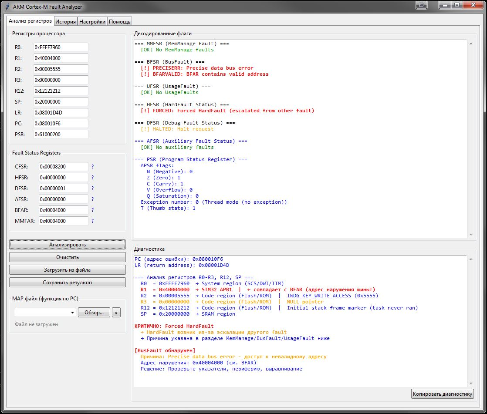

# ARM Cortex-M Fault Analyzer

A GUI tool for analyzing fault exceptions on ARM Cortex-M microcontrollers.

## Requirements

- Python 3.8+
- Standard library only (tkinter, json, os, sys, re, subprocess, datetime) - no third-party dependencies

## Usage

```bash
python arm_fault_analyzer.py
```

## Features

- Manual register input or loading from a JSON dump file
- MAP file support for two formats: **AC6 armlink** and **GNU LD** (auto-detected)
- PC / LR address resolution to function names via MAP file
- Register decoding: CFSR (MMFSR / BFSR / UFSR), HFSR, DFSR, AFSR, PSR
- ISR number decoding in PSR and EXC\_RETURN decoding in LR
- Analysis of R0-R3, R12, SP: memory region, magic value detection, BFAR/MMFAR match
- Persistent analysis history across sessions
- Report export to a text file
- One-click copy of diagnostics to clipboard
- **Localisation**: interface language selectable in Settings (Russian / English); applied after restart

## JSON Dump Format

```json
{
    "R0":    "0x20000100",
    "R1":    "0x00000000",
    "R2":    "0x08001234",
    "R3":    "0xDEADBEEF",
    "R12":   "0x00000000",
    "SP":    "0x20004FF0",
    "LR":    "0x08000401",
    "PC":    "0x08002468",
    "PSR":   "0x01000000",
    "CFSR":  "0x00000082",
    "HFSR":  "0x40000000",
    "DFSR":  "0x00000000",
    "AFSR":  "0x00000000",
    "BFAR":  "0x20000100",
    "MMFAR": "0x00000000"
}
```

Not all fields are required - missing registers default to `0x00000000`.

## Data Files

| File | Contents |
|------|----------|
| `arm_analyzer_config.json` | Application settings, paths, recent file lists, language |
| `arm_analyzer_history.json` | Analysis history (up to N entries, configurable) |
| `Locales/ru.json` | UI strings and diagnostics - Russian |
| `Locales/en.json` | UI strings and diagnostics - English |
| `Locales/help_ru.txt` | Help tab content - Russian |
| `Locales/help_en.txt` | Help tab content - English |

## Settings

The **Settings** tab allows you to configure:

- Default directory for loading JSON dumps
- Default directory for saving reports
- Recent files list size (MAP and JSON), 1 to 20 entries
- Maximum history entries, 10 to 500
- **Interface language** (Russian / English) - applied on restart

To add a new language, create `Locales/<lang>.json` and `Locales/help_<lang>.txt`,
then add the language code to the Combobox values in `create_settings_tab()`.

Full usage guide, register descriptions, and common fault scenarios are available in the **Help** tab inside the application.

## Interface



---

## Changelog

| Version | Date | Changes |
|---------|------|---------|
| 1.2 | April 2026 | Localisation support (ru/en): JSON locale files + help text files, language selector in Settings, auto-restart on language change |
| 1.1 | April 2026 | Added history saving for JSON and MAP files |
| 1.0 | April 2026 | Initial release |

---

*Document version: 1.2*
